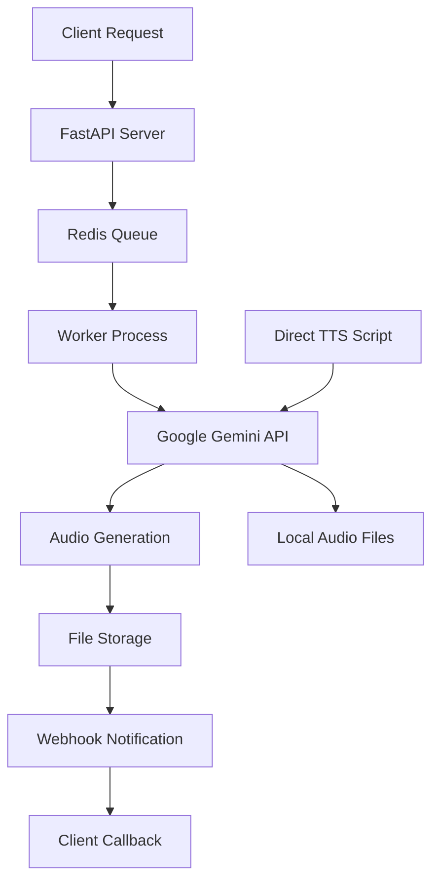

# 🎙️ Podlooma - Multi-Speaker TTS API

> **Professional Text-to-Speech API with Multi-Speaker Support**  
> Powered by Google Gemini 2.5 • Production-Ready • Webhook Integration • Global Deployment

[](https://python.org)
[](https://fastapi.tiangolo.com)
[](https://ai.google.dev)
[](https://pages.cloudflare.com)

## 🎯 **What is Podlooma?**

Podlooma is a **production-ready Text-to-Speech API** that converts dialogue scripts into high-quality audio with **multiple speakers**. Perfect for:

- 🎧 **Podcast Generation** - Create realistic multi-host conversations
- 📚 **Audiobook Narration** - Multiple character voices 
- 🎬 **Voice-over Production** - Professional dialogue generation
- 🤖 **AI Assistants** - Natural conversation flows
- 📱 **App Integration** - Add voice to any application

## ✨ **Key Features**

### 🎭 **Multi-Speaker Excellence**
- **Up to 2 speakers** with distinct voices and personalities
- **30+ voice options** from Google's premium collection
- **Natural dialogue flow** with proper timing and intonation
- **Emotional control** through natural language prompts

### 🚀 **Production Ready**
- **RESTful API** with comprehensive documentation
- **Webhook notifications** for success/failure events
- **Queue system** with Redis for background processing
- **Global deployment** ready (Cloudflare Pages + Local)
- **Beautiful web interface** for testing and demonstration

### 🎵 **High-Quality Audio**
- **24kHz 16-bit WAV** output format
- **Professional audio quality** suitable for broadcast
- **Large file support** - generates multi-MB files for long dialogues
- **Instant playback** in web browsers

### 🔧 **Developer Friendly**
- **Easy integration** with any programming language
- **Comprehensive API documentation** with examples
- **Multiple deployment options** (local, cloud, edge)
- **Full source code** available and customizable

---

## 📋 **Table of Contents**

1. [Quick Start](#-quick-start)
2. [Installation](#-installation)
3. [API Documentation](#-api-documentation)
4. [Voice Options](#-voice-options)
5. [Usage Examples](#-usage-examples)
6. [Webhook System](#-webhook-system)
7. [Deployment Options](#-deployment-options)
8. [Architecture](#-architecture)
9. [Troubleshooting](#-troubleshooting)
10. [Contributing](#-contributing)

---

## 🚀 **Quick Start**

### **Option 1: Direct TTS (Fastest)**
```bash
# Clone repository
git clone https://github.com/wayzEl/podlooma.git
cd podlooma

# Setup environment
python3 -m venv venv
source venv/bin/activate  # On Windows: venv\Scripts\activate
pip install -r requirements.txt

# Set your Google API key
export GOOGLE_API_KEY="your-google-api-key"

# Generate audio immediately
python3 direct_tts_google.py
```

### **Option 2: Full API Server**
```bash
# Start Redis (required for queue system)
redis-server

# Start API server
python3 main.py

# Start worker (in another terminal)
python3 worker.py

# Test the API
curl -X POST "http://localhost:8000/process-tts" \
  -H "Content-Type: application/json" \
  -d '{
    "dialogue": "Speaker 1: Hello world!\nSpeaker 2: This is amazing!",
    "voices": {"Speaker 1": "Kore", "Speaker 2": "Puck"},
    "model": "gemini-2.5-flash-preview-tts",
    "api_key": "your-google-api-key",
    "webhook_url": "https://webhook.site/your-endpoint",
    "Episode ID": "test-001"
  }'
```

### **Option 3: Cloudflare Pages (Production)**
```bash
# Deploy to global edge network
cd cloudflare/
# Follow deployment guide in cloudflare/README.md
```

---

## 🛠️ **Installation**

### **Prerequisites**
- **Python 3.9+**
- **Redis** (for queue system)
- **Google API Key** with Gemini access
- **ffmpeg** (optional, for audio processing)

### **Local Setup**
```bash
# 1. Clone the repository
git clone https://github.com/wayzEl/podlooma.git
cd podlooma

# 2. Create virtual environment
python3 -m venv venv
source venv/bin/activate

# 3. Install dependencies
pip install -r requirements.txt

# 4. Setup environment variables
cp .env.example .env
# Edit .env with your Google API key

# 5. Start Redis
redis-server

# 6. Run the application
python3 main.py
```

### **Docker Setup**
```bash
# Build and run with Docker Compose
docker-compose up -d
```

### **Requirements**
```
fastapi>=0.100.0
uvicorn>=0.23.0
google-genai>=1.27.0
redis>=4.5.0
rq>=1.15.0
python-dotenv>=1.0.0
requests>=2.31.0
```

---

## 📚 **API Documentation**

### **Base URL**
- **Local:** `http://localhost:8000`
- **Production:** `https://your-domain.pages.dev`

### **Authentication**
Include your Google API key in the request body:
```json
{
  "api_key": "your-google-api-key"
}
```

### **Endpoints**

#### **POST /process-tts**
Generate multi-speaker TTS audio from dialogue script.

**Request Body:**
```json
{
  "dialogue": "Speaker 1: Welcome to our podcast!\nSpeaker 2: Thanks for having me!",
  "voices": {
    "Speaker 1": "Kore",
    "Speaker 2": "Puck"
  },
  "model": "gemini-2.5-flash-preview-tts",
  "api_key": "your-google-api-key",
  "webhook_url": "https://your-webhook-endpoint.com/callback",
  "Episode ID": "unique-episode-identifier"
}
```

**Response:**
```json
{
  "status": "queued",
  "job_id": "uuid-here"
}
```

#### **GET /jobs/{job_id}**
Check the status of a TTS generation job.

**Response:**
```json
{
  "job_id": "uuid-here",
  "status": "finished",
  "result": "https://your-domain.com/audio/uuid-here.wav"
}
```

#### **GET /audio/{job_id}.wav**
Download the generated audio file.

**Response:** Audio file (WAV format)

### **Status Codes**
- **200** - Success
- **400** - Bad Request (missing required fields)
- **404** - Job or audio file not found
- **500** - Internal server error

---

## 🎭 **Voice Options**

Podlooma supports **30+ premium voices** from Google's Gemini TTS collection:

### **Voice Categories**

#### **Energetic & Upbeat**
| Voice | Personality | Best For |
|-------|-------------|----------|
| **Puck** | Upbeat, enthusiastic | Podcast hosts, energetic characters |
| **Fenrir** | Excitable, dynamic | Young characters, action scenes |
| **Laomedeia** | Upbeat, cheerful | Happy characters, commercials |
| **Sadachbia** | Lively, spirited | Active narrators, sports |

#### **Professional & Firm**
| Voice | Personality | Best For |
|-------|-------------|----------|
| **Kore** | Firm, authoritative | Business presentations, serious hosts |
| **Orus** | Strong, confident | Corporate voices, documentaries |
| **Alnilam** | Firm, reliable | Technical content, instructions |

#### **Smooth & Natural**
| Voice | Personality | Best For |
|-------|-------------|----------|
| **Algieba** | Smooth, flowing | Audiobooks, calm narration |
| **Despina** | Smooth, gentle | Meditation, educational content |
| **Achernar** | Soft, soothing | Bedtime stories, relaxation |

#### **Mature & Wise**
| Voice | Personality | Best For |
|-------|-------------|----------|
| **Gacrux** | Mature, experienced | Elderly characters, wisdom |
| **Sadaltager** | Knowledgeable, wise | Educational content, experts |

#### **Unique & Character**
| Voice | Personality | Best For |
|-------|-------------|----------|
| **Enceladus** | Breathy, intimate | Romantic scenes, whispers |
| **Algenib** | Gravelly, textured | Villains, rough characters |
| **Zubenelgenubi** | Casual, relaxed | Friendly conversations |

### **Voice Selection Tips**
1. **Match personality to character** - Choose voices that fit the speaker's role
2. **Consider contrast** - Use different voice types for clear distinction
3. **Test combinations** - Some voice pairs work better together
4. **Use style prompts** - Add emotional context in your dialogue

---

## 🎯 **Usage Examples**

### **1. Podcast Generation**
```python
import requests

def generate_podcast():
    dialogue = """
    Sarah: Welcome back to Tech Talk Today! I'm your host Sarah Chen.
    
    Alex: And I'm Alex Rodriguez. Today we're discussing the future of AI.
    
    Sarah: Alex, what's the most exciting development you've seen recently?
    
    Alex: Honestly, it's how natural AI voices have become. We're literally listening to artificial voices right now, and they sound completely human!
    
    Sarah: That's incredible! The technology has advanced so rapidly.
    """
    
    payload = {
        "dialogue": dialogue,
        "voices": {
            "Sarah": "Kore",  # Professional host voice
            "Alex": "Puck"    # Energetic guest voice
        },
        "model": "gemini-2.5-flash-preview-tts",
        "api_key": "your-api-key",
        "webhook_url": "https://your-webhook.com/callback",
        "Episode ID": "tech-talk-episode-001"
    }
    
    response = requests.post("http://localhost:8000/process-tts", json=payload)
    return response.json()
```

### **2. Audiobook Narration**
```python
def generate_audiobook_chapter():
    dialogue = """
    Narrator: Chapter One. The story begins on a dark and stormy night.
    
    Emma: I never expected my life to change so dramatically.
    
    Narrator: Emma thought to herself as she stared out the window.
    
    John: Are you ready for this adventure?
    
    Emma: I suppose there's no turning back now.
    """
    
    payload = {
        "dialogue": dialogue,
        "voices": {
            "Narrator": "Gacrux",    # Mature, wise narrator
            "Emma": "Despina",       # Smooth female voice
            "John": "Alnilam"        # Firm male voice
        },
        "model": "gemini-2.5-flash-preview-tts",
        "api_key": "your-api-key",
        "webhook_url": "https://your-webhook.com/callback",
        "Episode ID": "audiobook-chapter-001"
    }
    
    return requests.post("http://localhost:8000/process-tts", json=payload)
```

### **3. Educational Content**
```python
def generate_educational_content():
    dialogue = """
    Make the Teacher sound knowledgeable and authoritative, and the Student sound curious and engaged:
    
    Teacher: Today we'll explore the fascinating world of quantum physics.
    
    Student: I've always wondered how particles can be in multiple states at once!
    
    Teacher: That's an excellent question! This phenomenon is called superposition.
    
    Student: So a particle can essentially be everywhere and nowhere at the same time?
    
    Teacher: Precisely! You're grasping the concept beautifully.
    """
    
    payload = {
        "dialogue": dialogue,
        "voices": {
            "Teacher": "Sadaltager",  # Knowledgeable voice
            "Student": "Fenrir"       # Excitable, curious voice
        },
        "model": "gemini-2.5-flash-preview-tts",
        "api_key": "your-api-key",
        "webhook_url": "https://your-webhook.com/callback",
        "Episode ID": "physics-lesson-001"
    }
    
    return requests.post("http://localhost:8000/process-tts", json=payload)
```

### **4. Drama/Character Voices**
```python
def generate_dramatic_scene():
    dialogue = """
    Make the Hero sound confident and brave, and the Villain sound menacing and cold:
    
    Hero: I won't let you destroy this city!
    
    Villain: You think you can stop me? How delightfully naive.
    
    Hero: I've trained my whole life for this moment.
    
    Villain: Then you've wasted your whole life, foolish child.
    
    Hero: We'll see about that!
    """
    
    payload = {
        "dialogue": dialogue,
        "voices": {
            "Hero": "Orus",      # Strong, confident
            "Villain": "Algenib" # Gravelly, menacing
        },
        "model": "gemini-2.5-flash-preview-tts",
        "api_key": "your-api-key",
        "webhook_url": "https://your-webhook.com/callback",
        "Episode ID": "drama-scene-001"
    }
    
    return requests.post("http://localhost:8000/process-tts", json=payload)
```

### **5. JavaScript/Web Integration**
```javascript
async function generateTTS() {
    const payload = {
        dialogue: "Speaker 1: Hello from JavaScript!\nSpeaker 2: This integration is seamless!",
        voices: {
            "Speaker 1": "Kore",
            "Speaker 2": "Puck"
        },
        model: "gemini-2.5-flash-preview-tts",
        api_key: "your-api-key",
        webhook_url: "https://your-webhook.com/callback",
        "Episode ID": "js-integration-001"
    };
    
    try {
        const response = await fetch('http://localhost:8000/process-tts', {
            method: 'POST',
            headers: {
                'Content-Type': 'application/json',
            },
            body: JSON.stringify(payload)
        });
        
        const result = await response.json();
        console.log('Job ID:', result.job_id);
        
        // Check status
        setTimeout(async () => {
            const statusResponse = await fetch(`http://localhost:8000/jobs/${result.job_id}`);
            const status = await statusResponse.json();
            console.log('Status:', status);
        }, 5000);
        
    } catch (error) {
        console.error('Error:', error);
    }
}
```

---

## 📡 **Webhook System**

The webhook system provides real-time notifications when TTS jobs complete or fail.

### **Webhook Payloads**

#### **Success Notification**
```json
{
  "episode_id": "your-episode-id",
  "status": "success",
  "audio_url": "https://your-domain.com/audio/job-id.wav"
}
```

#### **Failure Notification**
```json
{
  "episode_id": "your-episode-id",
  "status": "failed",
  "error": "Error description here"
}
```

### **Webhook Server Example**
```python
from fastapi import FastAPI, Request

app = FastAPI()

@app.post("/webhook")
async def handle_webhook(request: Request):
    data = await request.json()
    
    if data["status"] == "success":
        print(f"✅ Audio ready: {data['audio_url']}")
        # Download and process the audio file
        audio_url = data["audio_url"]
        # Your processing logic here
        
    elif data["status"] == "failed":
        print(f"❌ Generation failed: {data['error']}")
        # Handle the error
        
    return {"status": "received"}
```

### **Testing Webhooks**
Use [webhook.site](https://webhook.site) for quick testing:
```json
{
  "webhook_url": "https://webhook.site/your-unique-id"
}
```

---

## 🚀 **Deployment Options**

### **1. Cloudflare Pages (Recommended)**

#### **Why Cloudflare Pages?**
- ✅ **Global Edge Network** - Ultra-low latency worldwide
- ✅ **No Server Management** - Serverless functions handle everything
- ✅ **Unlimited Concurrent Users** - Handle multiple requests simultaneously
- ✅ **No Worker Fork Issues** - Bypasses local development problems
- ✅ **Professional Domain** - Custom domain support
- ✅ **Built-in Analytics** - Request monitoring and insights

#### **Quick Deploy**
```bash
# 1. Push your code to GitHub (already done!)
# 2. Visit https://dash.cloudflare.com/pages
# 3. "Create a project" → Connect your GitHub repo
# 4. Build settings:
#    - Root directory: cloudflare
#    - Build command: (empty)
#    - Output directory: ./
# 5. Environment variables:
#    - GOOGLE_API_KEY: your-api-key
# 6. Deploy!
```

#### **Features Available in Cloudflare Deployment:**
- 🌐 **Beautiful Web Interface** at your domain
- 🎵 **Instant TTS Generation** - No queues, immediate processing
- 📡 **Webhook Support** - Full callback integration
- 🔧 **API Endpoints** - Complete REST API
- 📊 **Built-in Monitoring** - Request analytics
- 🌍 **Global CDN** - Worldwide audio delivery

### **2. Local Development**
Perfect for development and testing:
```bash
# Terminal 1: Redis
redis-server

# Terminal 2: API Server
python3 main.py

# Terminal 3: Worker
python3 worker.py

# Terminal 4: Webhook Testing (optional)
python3 webhook_test_server.py
```

### **3. Docker Deployment**
```yaml
# docker-compose.yml
version: '3.8'
services:
  redis:
    image: redis:alpine
    ports:
      - "6379:6379"
  
  api:
    build: .
    ports:
      - "8000:8000"
    environment:
      - GOOGLE_API_KEY=${GOOGLE_API_KEY}
      - REDIS_URL=redis://redis:6379
    depends_on:
      - redis
  
  worker:
    build: .
    command: python worker.py
    environment:
      - GOOGLE_API_KEY=${GOOGLE_API_KEY}
      - REDIS_URL=redis://redis:6379
    depends_on:
      - redis
```

### **4. Cloud Platforms**

#### **Render.com**
- Uses `render.yaml` configuration
- Automatic scaling
- Built-in Redis

#### **Railway**
- Simple GitHub integration
- Environment variable management
- Automatic HTTPS

#### **Heroku**
- Add Redis addon
- Configure worker dynos
- Set environment variables

---

## 🏗️ **Architecture**

### **System Components**



### **File Structure**
```
podlooma/
├── 📄 main.py                 # FastAPI server & API endpoints
├── 🔧 worker.py              # Background job processor
├── 🎵 tasks_new.py           # TTS generation logic
├── ⚡ direct_tts_google.py   # Direct TTS script (no queue)
├── 🌐 webhook_test_server.py # Webhook testing utility
├── 📋 requirements.txt       # Python dependencies
├── 📚 README.md              # This documentation
├── 
├── 🗂️ cloudflare/           # Cloudflare Pages deployment
│   ├── 📄 index.html         # Web interface
│   ├── ⚙️ functions/         # Edge functions
│   │   └── api/
│   │       ├── tts.js        # TTS generation endpoint
│   │       └── audio/[id].js # Audio serving
│   ├── 📋 wrangler.toml      # Cloudflare config
│   └── 📚 README.md          # Deployment guide
│
├── 🗂️ output/              # Generated audio files
├── 🗂️ static/              # Static assets
└── 🗂️ tests/               # Test scripts
```

### **Data Flow**

#### **Queue-Based Processing (Production)**
1. **Client** sends TTS request to `/process-tts`
2. **FastAPI** validates request and queues job
3. **Redis** stores job data
4. **Worker** picks up job and processes
5. **Google Gemini** generates audio
6. **System** saves audio file and sends webhook
7. **Client** receives notification and downloads audio

#### **Direct Processing (Development)**
1. **Script** calls TTS function directly
2. **Google Gemini** generates audio immediately
3. **System** saves audio file locally
4. **User** can play audio instantly

### **Security Considerations**
- 🔐 **API Keys** - Never expose in client-side code
- 🛡️ **Rate Limiting** - Implement to prevent abuse
- 🔒 **HTTPS** - Always use encrypted connections
- 🎫 **Authentication** - Consider API key management
- 📊 **Monitoring** - Track usage and errors

---

## 🔧 **Troubleshooting**

### **Common Issues**

#### **🚫 "Worker terminated unexpectedly"**
**Problem:** macOS fork() issues with worker processes  
**Solution:** Use direct TTS script or deploy to Cloudflare Pages
```bash
# Quick fix: Use direct generation
python3 direct_tts_google.py
```

#### **❌ "API key invalid"**
**Problem:** Google API key not configured or invalid  
**Solutions:**
1. Check your API key at [Google AI Studio](https://aistudio.google.com)
2. Ensure TTS access is enabled
3. Verify environment variable is set:
```bash
echo $GOOGLE_API_KEY
```

#### **🔇 "Audio file is 0:00 duration"**
**Problem:** Using wrong model or API response issues  
**Solutions:**
1. Use correct model: `gemini-2.5-flash-preview-tts`
2. Check API response format
3. Verify dialogue format (Speaker names match voices)

#### **📡 "Webhook not received"**
**Problem:** Webhook endpoint issues  
**Solutions:**
1. Test webhook URL with [webhook.site](https://webhook.site)
2. Check firewall/port settings
3. Verify webhook server is running
```bash
python3 webhook_test_server.py
```

#### **🐛 "Redis connection failed"**
**Problem:** Redis server not running  
**Solutions:**
```bash
# Start Redis
redis-server

# Check Redis status
redis-cli ping
# Should respond: PONG
```

#### **💾 "Large file upload issues"**
**Problem:** Audio files too large for deployment platform  
**Solutions:**
1. Use shorter dialogues (< 1000 characters)
2. Implement cloud storage (AWS S3, Cloudflare R2)
3. Use streaming audio delivery

### **Performance Optimization**

#### **🚀 Speed Improvements**
- Use **direct TTS script** for immediate results
- Deploy to **Cloudflare Pages** for global edge processing
- Keep dialogues **under 1000 characters** for faster generation
- Use **webhook notifications** instead of polling

#### **💰 Cost Optimization**
- Monitor **Google API usage** in Google Cloud Console
- Implement **request caching** for repeated content
- Use **shorter dialogues** to reduce token usage
- Set up **usage alerts** and quotas

#### **🔄 Reliability Improvements**
- Implement **retry logic** for failed requests
- Add **request validation** before processing
- Use **health checks** for all services
- Monitor **error rates** and response times

### **Debug Mode**
Enable detailed logging:
```python
import logging
logging.basicConfig(level=logging.DEBUG)
```

### **Getting Help**
1. **Check logs** - Look for error messages in console output
2. **Test components** - Isolate the issue (API, worker, webhook)
3. **Use direct script** - Bypass queue system for testing
4. **Check examples** - Verify your request format matches examples
5. **Create issue** - Report bugs with detailed error messages

---

## 🎨 **Customization**

### **Adding New Voices**
```python
# In tasks_new.py, update voice mapping
VOICE_MAPPING = {
    "custom_voice_name": "Google-Voice-ID",
    # Add your custom mappings
}
```

### **Custom Audio Processing**
```python
# In tasks_new.py, modify audio export
def process_audio(audio_data):
    # Add your custom audio processing
    audio_segment = AudioSegment(data=audio_data, ...)
    
    # Apply effects
    audio_segment = audio_segment.fade_in(1000).fade_out(1000)
    
    # Export with custom settings
    audio_segment.export(file_path, format="mp3", bitrate="192k")
```

### **Custom Webhook Handling**
```python
# Create custom webhook processor
class CustomWebhookHandler:
    def handle_success(self, episode_id, audio_url):
        # Custom success handling
        pass
    
    def handle_failure(self, episode_id, error):
        # Custom error handling
        pass
```

---

## 🧪 **Testing**

### **Test Scripts Included**
```bash
# Test webhook system
python3 webhook_test_server.py
python3 quick_webhook_test.py

# Test TTS generation
python3 direct_tts_google.py

# Test full API integration
python3 test_webhook_integration.py

# Debug task processing
python3 debug_task.py
```

### **Unit Tests**
```bash
# Run test suite
python3 -m pytest tests/

# Test specific component
python3 -m pytest tests/test_tts.py
```

### **Load Testing**
```bash
# Install load testing tools
pip install locust

# Run load tests
locust -f tests/load_test.py
```

---

## 📊 **Monitoring & Analytics**

### **Key Metrics to Track**
- 📈 **Request volume** - Requests per minute/hour
- ⏱️ **Response times** - Average generation time
- ✅ **Success rate** - Percentage of successful generations
- 💰 **API costs** - Google API usage and costs
- 🌍 **Geographic distribution** - Where requests come from
- 🎵 **Audio quality** - File sizes and duration

### **Monitoring Setup**
```python
# Add monitoring to your application
import time
import logging

def monitor_request(func):
    def wrapper(*args, **kwargs):
        start_time = time.time()
        try:
            result = func(*args, **kwargs)
            duration = time.time() - start_time
            logging.info(f"Request completed in {duration:.2f}s")
            return result
        except Exception as e:
            logging.error(f"Request failed: {e}")
            raise
    return wrapper

@monitor_request
def generate_tts(*args, **kwargs):
    # Your TTS logic
    pass
```

---

## 🤝 **Contributing**

We welcome contributions! Here's how to get started:

### **Development Setup**
```bash
# Fork the repository
git clone https://github.com/your-username/podlooma.git
cd podlooma

# Create development branch
git checkout -b feature/your-feature-name

# Install development dependencies
pip install -r requirements-dev.txt

# Run tests
python3 -m pytest
```

### **Contribution Guidelines**
1. **Follow PEP 8** - Python code style guidelines
2. **Add tests** - Include tests for new features
3. **Update docs** - Update README for new features
4. **Create issues** - Discuss major changes first
5. **Small commits** - Make focused, atomic commits

### **Areas for Contribution**
- 🎵 **New voice options** - Add support for more TTS providers
- 🌍 **Internationalization** - Support for more languages
- 🎨 **UI improvements** - Enhance the web interface
- 📊 **Analytics** - Add usage tracking and insights
- 🔧 **Performance** - Optimize generation speed
- 📚 **Documentation** - Improve examples and guides

---

## 📄 **License**

This project is licensed under the MIT License - see the [LICENSE](LICENSE) file for details.

---

## 🙏 **Acknowledgments**

- **Google Gemini** - For providing excellent TTS capabilities
- **FastAPI** - For the amazing web framework
- **Cloudflare** - For global edge computing platform
- **Redis** - For reliable queue management
- **Community** - For feedback and contributions

---

## 📞 **Support**

- 🐛 **Bug Reports**: [GitHub Issues](https://github.com/wayzEl/podlooma/issues)
- 💡 **Feature Requests**: [GitHub Discussions](https://github.com/wayzEl/podlooma/discussions)
- 📧 **Email**: [contact@podlooma.com](mailto:contact@podlooma.com)
- 💬 **Discord**: [Join our community](https://discord.gg/podlooma)

---

## 🚀 **What's Next?**

### **Upcoming Features**
- 🎭 **More Speakers** - Support for 3+ speakers in dialogue
- 🌍 **Language Support** - Multiple language TTS generation
- 🎨 **Audio Effects** - Built-in audio processing and effects
- 📱 **Mobile App** - iOS and Android applications
- 🤖 **AI Integration** - Automatic script generation from prompts
- 📊 **Analytics Dashboard** - Usage insights and optimization

### **Roadmap**
- **Q1 2025**: Multi-language support, 3+ speaker dialogues
- **Q2 2025**: Mobile applications, advanced audio effects
- **Q3 2025**: AI script generation, enterprise features
- **Q4 2025**: Analytics platform, premium voice options

---

<div align="center">

**⭐ Star this repository if you find it useful!**

**🔗 Share with others who might benefit from professional TTS capabilities**

**🤝 Contribute to make Podlooma even better**

</div>

---

*Built with ❤️ for developers who need professional voice generation capabilities.* 